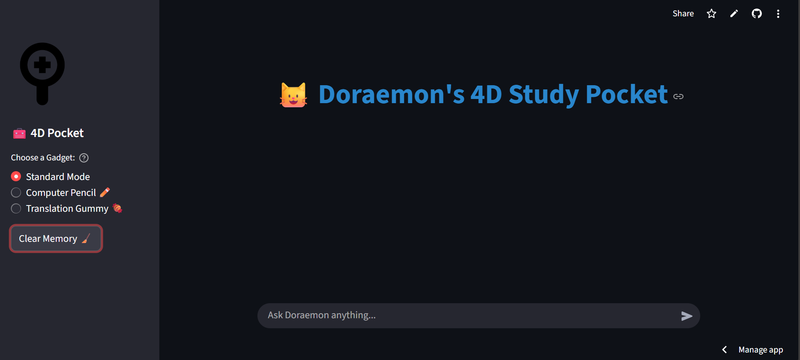

# 🐱 Doraemon's 4D Study Pocket: AI Persona Assistant

[]https://your-app-link.streamlit.app/
[](https://ai.google.dev/)
[](https://www.python.org/)

**Doraemon's 4D Study Pocket** is a next-generation AI tutor prototype that brings the iconic robot cat to life. Built using **Google Gemini 2.5 Flash** and **Streamlit**, this application demonstrates advanced prompt engineering and real-time LLM interaction to help students (aka "Nobita") with their daily learning.



---

## 🚀 Key Features

- **Dynamic Persona Interaction:** A consistent Doraemon personality that encourages and assists users with a friendly, character-accurate tone.
- **4D Pocket Gadget System:**
  - **Standard Mode:** General conversation and daily help.
  - **Computer Pencil ✏️:** Optimized for step-by-step STEM problem solving and logical reasoning.
  - **Translation Gummy 🍬:** Instant multilingual support with a focus on Japanese-English translation.
- **Theme-Aware UI:** Custom CSS integration ensuring seamless readability in both **Light and Dark modes**.
- **Session Persistence:** Maintains conversation history throughout the session using Streamlit `session_state`.

## 🛠️ Tech Stack

- **Frontend:** [Streamlit](https://streamlit.io/) (Python-based web framework)
- **AI Backend:** [Google Gemini 2.5 Flash API](https://ai.google.dev/)
- **Deployment:** Streamlit Community Cloud
- **Version Control:** Git & GitHub

## 🧑‍💻 Installation & Local Setup

To run this project on your local machine:

1. **Clone the repository:**
   ```bash
   git clone [https://github.com/deepadharshinibalamurugan/Doraemon-Study-AI.git](https://github.com/deepadharshinibalamurugan/Doraemon-Study-AI.git)
   cd Doraemon-Study-AI
